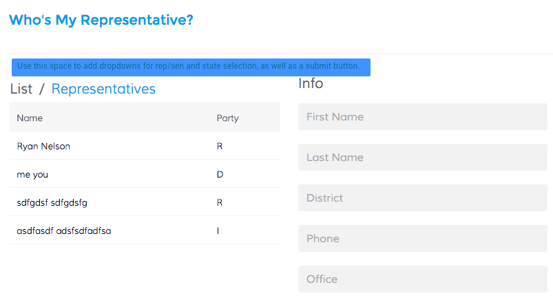

# Front End Challenge
For this programming test you are tasked with creating an interface around 
the open API located at http://whoismyrepresentative.com/api. 
However, to get around CORs limitation, we are providing an extremely simple node application 
that will act as a layer between your client app and the API.  If you want to and can get around the CORs limitation, 
feel free to ignore the node server.  If you don't want the hassle, you can follow the instructions 
below to get everything up and running. If you do, you will be using the node app as your API - you will not be accessing whoismyrepresentative.com directly from your client side app

In your client side application, you will be making use of two of the endpoints that are offered: 

* /representatives/:state
* /senators/:state

Your application should allow the user to: 

* Select if he/she would like to search by Representative or by Senator
* Select which state to return results for
* View a results list after #1 and #2 have been selected
* Display name and party affiliation
* View more information about the representative/senator by clicking on his/her name in the results list (district,  phone, office and a link to his/her website)

Your website should be built using React and match the following design.
Feel free to use whatever libraries you want to make the design fit.

Priorities: 

1) Functionality
2) Design
3) Code organization
4) Proper error handling (make sure they select something before clicking on the button to fetch results)

If you have any questions, please let us know. 




# find-rep-api
Super simple api to get results from http://whoismyrepresentative.com/api

#Installation

* Install node (v6+)
* Run `npm install` or `yarn`
* Run `npm start`
* Enjoy immensely.

###Available endpoints: 

`/representatives/:state`

_:state_ must be a valid state abbreviation (UT, WY, MO...etc)

**response**
```json
{  
   "success":true,
   "results":[  
      {  
         "name":"Rob Bishop",
         "party":"R",
         "state":"UT",
         "district":"1",
         "phone":"202-225-0453",
         "office":"123 Cannon House Office Building",
         "link":"http://robbishop.house.gov"
      },
      {  
         "name":"Jason Chaffetz",
         "party":"R",
         "state":"UT",
         "district":"3",
         "phone":"202-225-7751",
         "office":"2464 Rayburn House Office Building",
         "link":"http://chaffetz.house.gov"
      },
      {  
         "name":"Jim Matheson",
         "party":"D",
         "state":"UT",
         "district":"4",
         "phone":"202-225-3011",
         "office":"2211 Rayburn House Office Building",
         "link":"http://matheson.house.gov"
      },
      {  
         "name":"Chris Stewart",
         "party":"R",
         "state":"UT",
         "district":"2",
         "phone":"202-225-9730",
         "office":"323 Cannon House Office Building",
         "link":"http://stewart.house.gov"
      }
   ]
}
```

`/senators/:state`

_:state_ must be a valid state abbreviation (UT, WY, MO...etc)

**response**
```json
{  
   "success":true,
   "results":[  
      {  
         "name":"Orrin Hatch",
         "party":"R",
         "state":"UT",
         "district":"Senior Seat",
         "phone":"202-224-5251",
         "office":"104 Hart Senate Office Building",
         "link":"http://www.hatch.senate.gov"
      },
      {  
         "name":"Mike Lee",
         "party":"R",
         "state":"UT",
         "district":"Junior Seat",
         "phone":"202-224-5444",
         "office":"316 Hart Senate Office Building",
         "link":"http://www.lee.senate.gov"
      }
   ]
}
```

